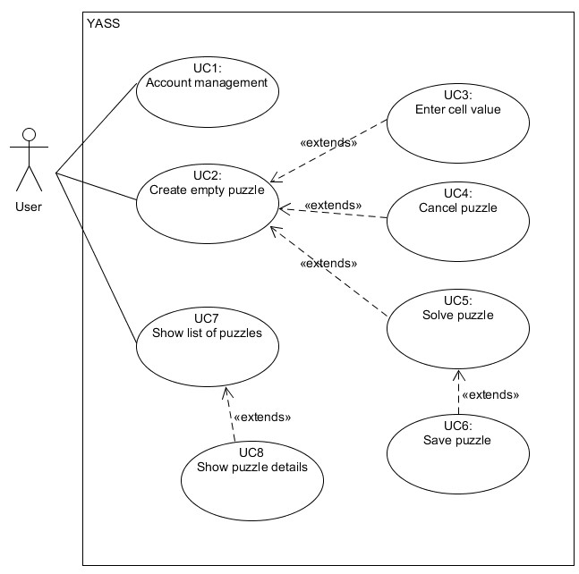

# Aanleiding

YASS is een mobiele app om een Sudoku op te lossen. YASS staat voor Yet Another Sudoku Solver. Dit kan op basis van manuele input, maar ook op basis van een foto die wordt gemaakt met de camera. Een gebruiker moet een account kunnen maken en eerder opgeloste puzzles kunnen bekijken. Bij het oplossen van een puzzle worden gegevens over de oplossing getoond.

# Requirements

## Functionele requirements

Prioritering op volgorde van belangrijk naar minder belangrijk
Opdrachtgever is eigenaar van alle requirements.

| Id  | Beschrijving                                                                                        | Prio |
| :-- | :-------------------------------------------------------------------------------------------------- | :--- |
| F1  | De gebruiker start een lege Sudoku van 9\*9 cellen                                                  | 100  |
| F2  | De gebruiker breekt de puzzle af                                                                    | 95   |
| F3a | De gebruiker vult een cel in van de sudoku met een juiste waarde                                    | 90   |
| F3b | De gebruiker vult een cel in van de sudoku met een onjuiste waarde                                  | 85   |
| F4  | De gebruiker bekijkt de mogelijke waarden van een cel                                               | 80   |
| F5  | De gebruiker laat de puzzle oplossen                                                                | 75   |
| F6  | De gebruiker rondt de puzzle zelf succesvol af                                                      | 70   |
| F7a | De gebruiker vraagt een invulsuggestie                                                              | 65   |
| F7b | De gebruiker past de invulsuggestie automatisch toe                                                 | 60   |
| F8  | De gebruiker ziet welke cellen makkelijk in te vullen zijn                                          | 55   |
| F9a | De gebruiker bekijkt hoe lang het duurde om de puzzle automatisch op te laten lossen                | 50   |
| F9b | De gebruiker bekijkt hoeveel niveaus diep de brute force oplossing nodig had                        | 45   |
| F10 | De gebruiker slaat zijn puzzle op                                                                   | 40   |
| F11 | De gebruiker bekijkt een lijst van eerder opgeloste puzzels                                         | 35   |
| F12 | De gebruiker bekijkt een opgeloste puzzel uit de lijst opgeloste puzzels                            | 30   |
| F13 | De gebruiker start een puzzle het het maken van een foto van een fysieke Sudoku puzzle (OCR)        | 25   |
| F14 | De gebruiker start een gegenereerde puzzel op basis van een geselecteerde moeilijkheidsgraag (API?) | 20   |

## Niet functionele requirements

| Id  | Beschrijving                                                                                                              |
| :-- | :------------------------------------------------------------------------------------------------------------------------ |
| 1   | Fouten van de gebruiker worden opgevangen en correct afgehandeld zodat de applicatie niet crashed (User error protection) |
| 2   | Het systeem kan gebruikt worden zonder handleiding (Operability)                                                          |
| 3   | Persoonlijk opgeslagen gegevens zijn niet toegankelijk voor derden (Confidentiality)                                      |
| 4   | De applicatie is installeerbaar via een appstore (Installability)                                                         |

## Randvoorwaarden

- Applicatie wordt gemaakt in .net MAUI
- Gegevens worden lokaal opeslagen in een SQLite database
- Applicatie loopt op zijn minst op Android
- Regels van standaard Sudoku zijn van toepassing
- Wetgeving wordt gerespecteerd

# Ontwerp

## Usecase diagram

Hieronder het usecase diagram waarin al bovenstaande requirements zouden moeten kunnen worden ondergebracht.

## Wireframes

# Project opbouw

De solution YASS.sln bevat twee projecten:

- SudokuSolver: Library met de logica om puzzels op te lossen
- YASS_Mobile: MAUI mobile app

Alle projecten in .NET 8
