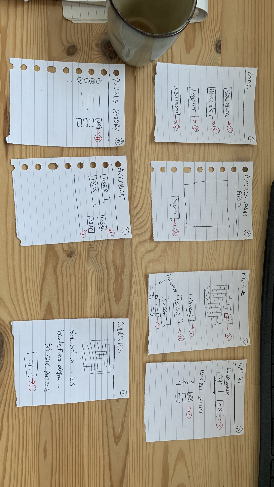
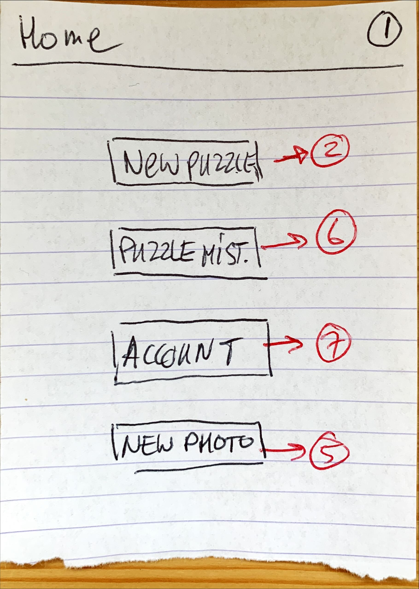
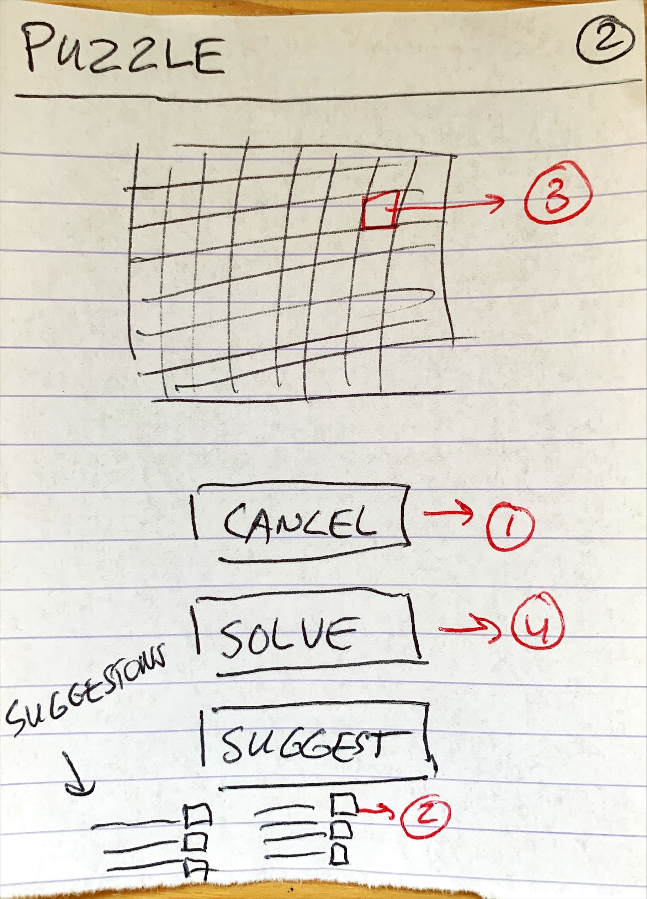
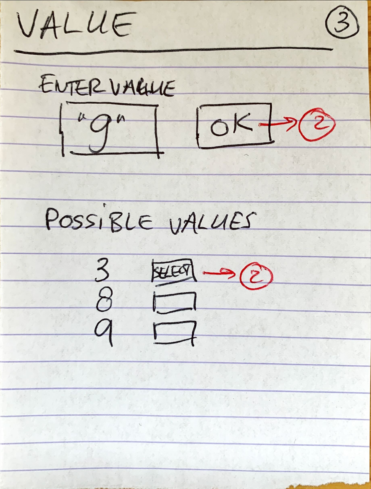
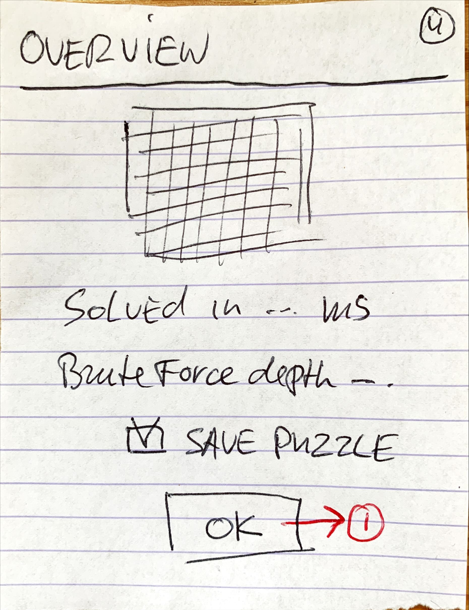
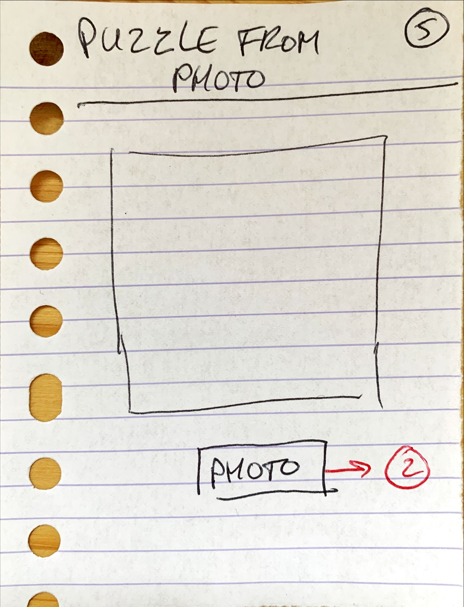
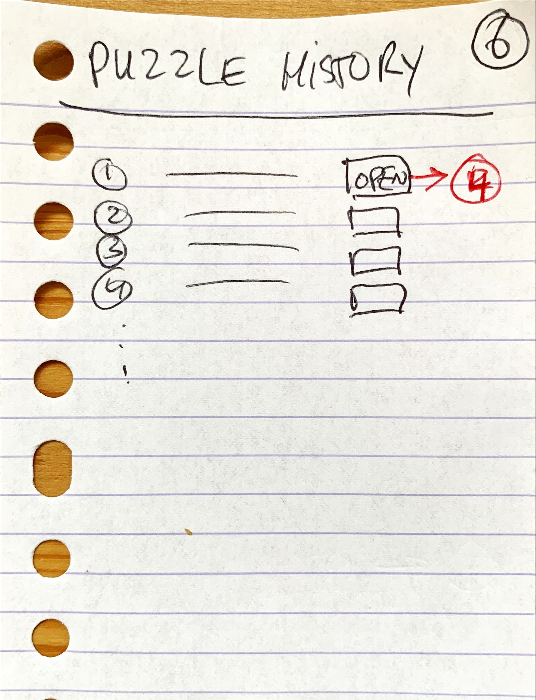
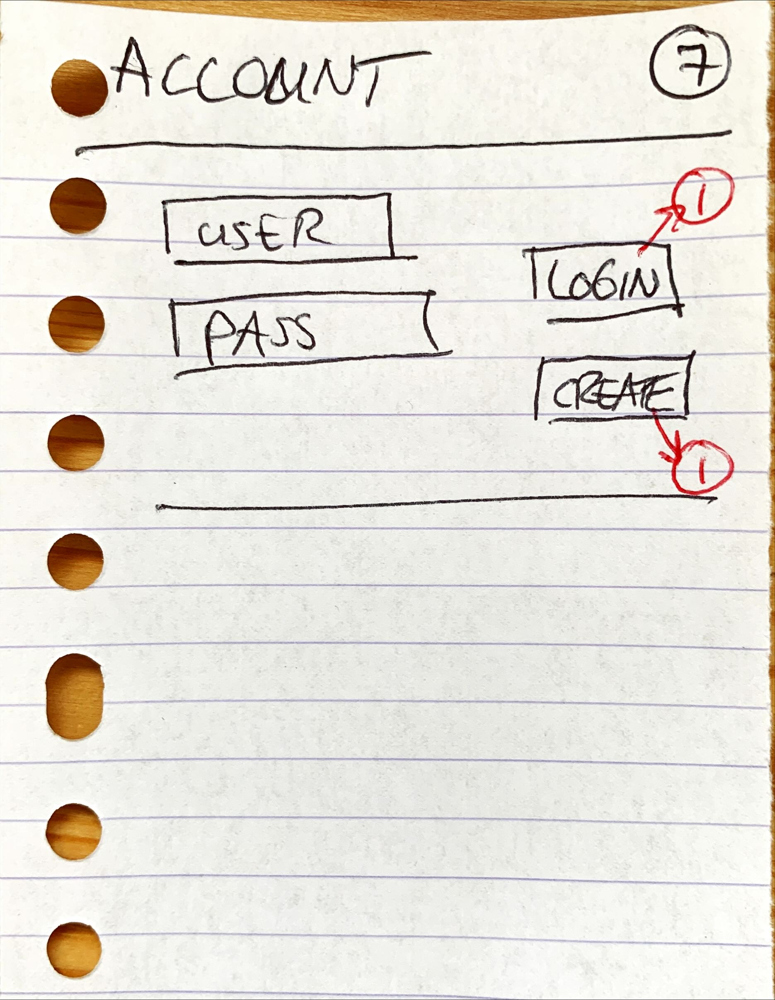
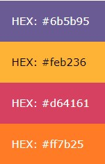

# Aanleiding

YASS is een mobiele app om een Sudoku op te lossen. YASS staat voor Yet Another Sudoku Solver. Dit kan op basis van manuele input, maar ook op basis van een foto die wordt gemaakt met de camera. Een gebruiker moet een account kunnen maken en eerder opgeloste puzzles kunnen bekijken. Bij het oplossen van een puzzle worden gegevens over de oplossing getoond.

# Requirements

## Functionele requirements

Prioritering op volgorde van belangrijk naar minder belangrijk
Opdrachtgever is eigenaar van alle requirements.

| Id  | Beschrijving                                                                                        | Prio |
| :-- | :-------------------------------------------------------------------------------------------------- | :--- |
| F1  | De gebruiker begint een nieuwe lege puzzle                                                          | 100  |
| F2  | De gebruiker annuleert de puzzle                                                                    | 95   |
| F3  | De gebruiker vult een cel in van de puzzle met een waarde                                           | 90   |
| F4  | De gebruiker raadpleegt de mogelijke waarden van een cel                                            | 80   |
| F5  | De gebruiker laat de puzzle oplossen door het systeem                                               | 75   |
| F6  | De gebruiker rondt de puzzle zelf succesvol af                                                      | 70   |
| F7a | De gebruiker vraagt een invulsuggestie                                                              | 65   |
| F7b | De gebruiker past de invulsuggestie automatisch toe                                                 | 60   |
| F8  | De gebruiker ziet welke cellen makkelijk in te vullen zijn                                          | 55   |
| F9a | De gebruiker bekijkt hoe lang het duurde om de puzzle automatisch op te laten lossen                | 50   |
| F9b | De gebruiker bekijkt hoeveel niveaus diep de brute force oplossing nodig had                        | 45   |
| F10 | De gebruiker slaat zijn puzzle op                                                                   | 40   |
| F11 | De gebruiker bekijkt een lijst van eerder opgeloste puzzels                                         | 35   |
| F12 | De gebruiker bekijkt een opgeloste puzzel uit de lijst opgeloste puzzels                            | 30   |
| F13 | De gebruiker start een puzzle het het maken van een foto van een fysieke puzzle (OCR)               | 25   |
| F14 | De gebruiker start een gegenereerde puzzel op basis van een geselecteerde moeilijkheidsgraad (API?) | 20   |
| F15 | De gebruiker slaat een niet afgeronde puzzle op om later aan verder te werken                       | 0    |
| F16 | De gebruiker speelt verder op een ander device dan het device waarop de puzzel is aangemaakt        | 0    |

## Niet functionele requirements

| Id  | Beschrijving                                                                                                              |
| :-- | :------------------------------------------------------------------------------------------------------------------------ |
| NF1 | Fouten van de gebruiker worden opgevangen en correct afgehandeld zodat de applicatie niet crashed (User error protection) |
| NF2 | Het systeem kan gebruikt worden zonder handleiding (Operability)                                                          |
| NF3 | Persoonlijk opgeslagen gegevens zijn niet toegankelijk voor derden (Confidentiality)                                      |
| NF4 | De applicatie is installeerbaar via een appstore (Installability)                                                         |

## Randvoorwaarden

- Applicatie wordt gemaakt in .net MAUI
- Gegevens die lokaal worden opgeslagen, worden opgeslagen in een SQLite database
- Gegevens die niet lokaal worden opgeslagen, is nader te bepalen
- Applicatie loopt op zijn minst op Android
- Regels van standaard Sudoku zijn van toepassing
- Wetgeving wordt gerespecteerd

# Ontwerp

## Usecase diagram

Hieronder het usecase diagram waarin al bovenstaande requirements zouden moeten kunnen worden ondergebracht.

## Wireframes

Het doel van de wireframes is inzichtelijk maken wat er op de schermen staat binnen de applicatie en hoe er genavigeerd wordt tussen deze schermen. Hieronder per scherm een toelichting.

### Overview

| Wireframe                                                              | Titel             | Beschrijving                                                                                                                                                                                                                                                     | Requirements                 |
| :--------------------------------------------------------------------- | :---------------- | :--------------------------------------------------------------------------------------------------------------------------------------------------------------------------------------------------------------------------------------------------------------- | :--------------------------- |
|                          | Home              | Startscherm van de applicatie. Vanuit hier is het hoofdmenu beschikbaar. Knop "Puzzle History" is alleen beschikbaar indien ingelogd.                                                                                                                            | F1, F11                      |
|                      | Puzzle            | Scherm met edit weergave van een puzzle. Vanuit hier kan een gebruiker een cel in de puzzle aanlikken om de waarde in te vullen. Tevens kunnen suggesties getoond worden. Achter elke suggestie staat een apply knop zodat deze suggestie uitgevoerd kan worden. | F1, F2, F3, F5, F6, F7a, F7b |
|                        | Value             | Gebruiker vult de waarde van een geselecteerde cel in. Tevens worden de nog mogelijke waarden getoond. Alleen geldende waarden mogen worden ingevuld.                                                                                                            | F3a, F4                      |
|           | Puzzle overview   | Scherm wordt getoond als de puzzle is opgelost of niet oplosbaar is. Eindresultaat wordt getoond. Statistieken worden getoond. Puzzle kan worden opgeslagen indien de gebruiker is ingelogd.                                                                     | F9a, F9b, F10, F12           |
|  | Puzzle from photo | Enige functie is het maken van een foto. Middels OCR wordt deze omgezet in een puzzle voor scherm 2.                                                                                                                                                             | F13                          |
|       | Puzzle history    | Lijst van opgeslagen puzzels voor het account. Na kiezen van puzzle wordt "Puzzle overview" gebruikt om de puzzle te tonen.                                                                                                                                      | F11                          |
|                    | Account           | Gebruiker kan inloggen of een account maken.                                                                                                                                                                                                                     | NF3                          |

Buiten beschouwing in het ontwerp op dit moment:

- F8
- F14

# Project opbouw

De solution YASS.sln bevat twee projecten:

- SudokuSolver: Library met de logica om puzzels op te lossen
- YASS_Mobile: MAUI mobile app

Alle projecten in .NET 8

# Design

Gebruik het volgende kleuren pallet:

| Code         | Doel                   |
| :----------- | :--------------------- |
| HEX: #6b5b95 | Text (ook logo)        |
| HEX: #feb236 | Achtergrond (ook logo) |
| HEX: #d64161 |                        |
| HEX: #ff7b25 |                        |

